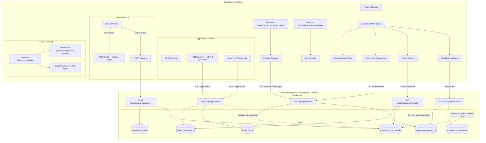
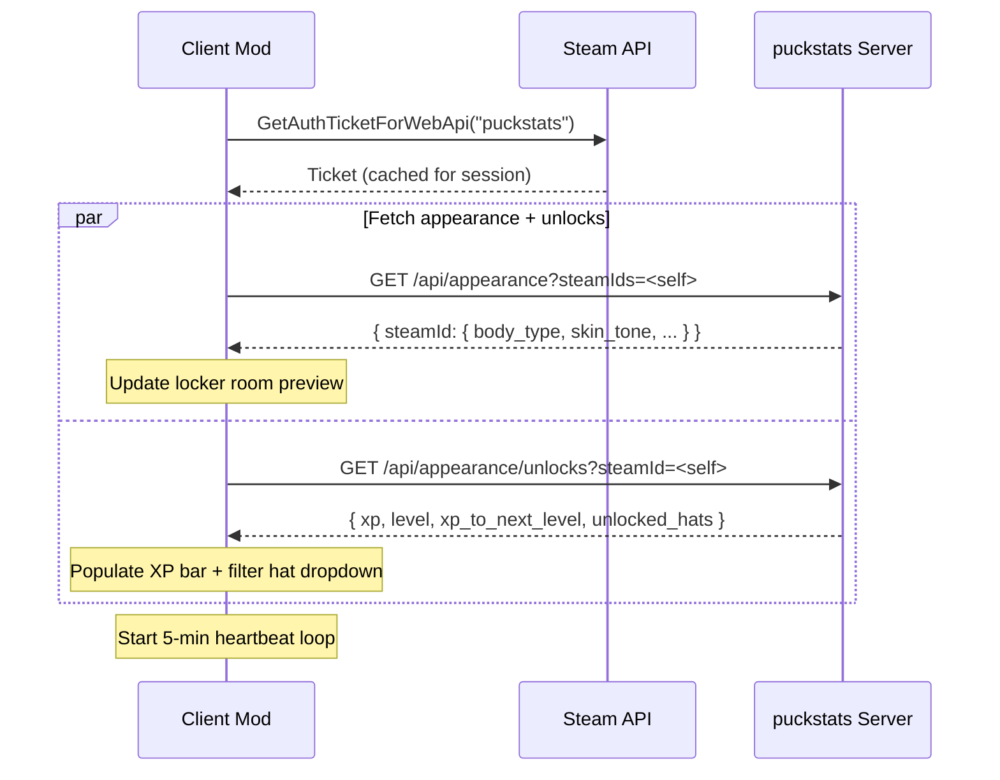
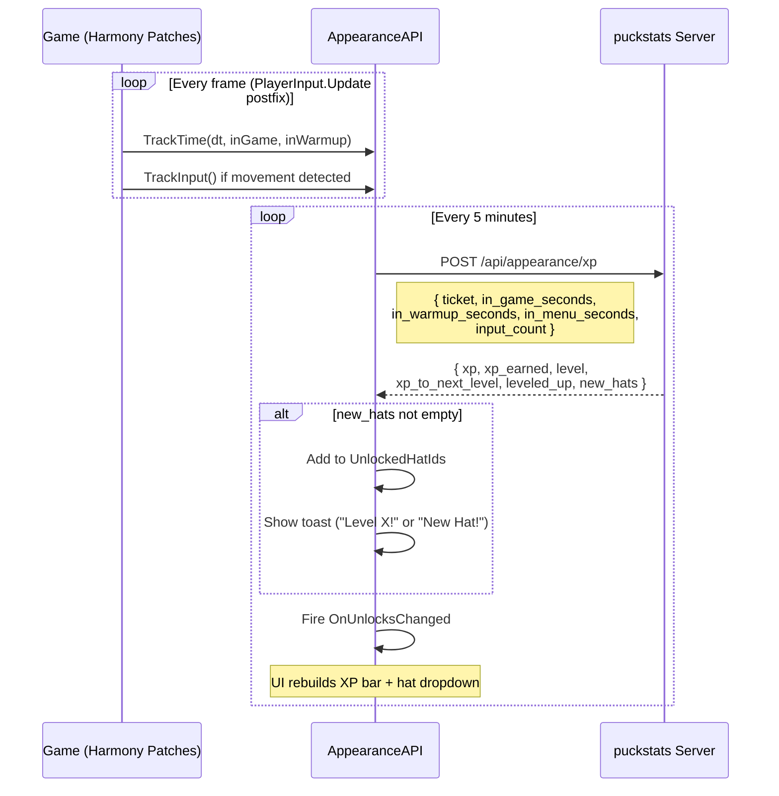
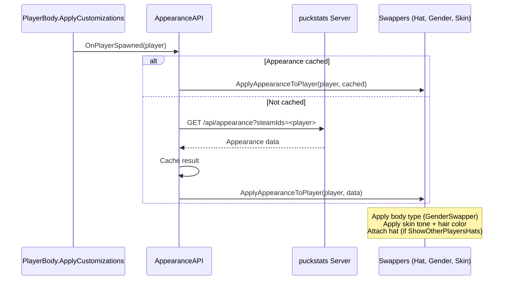
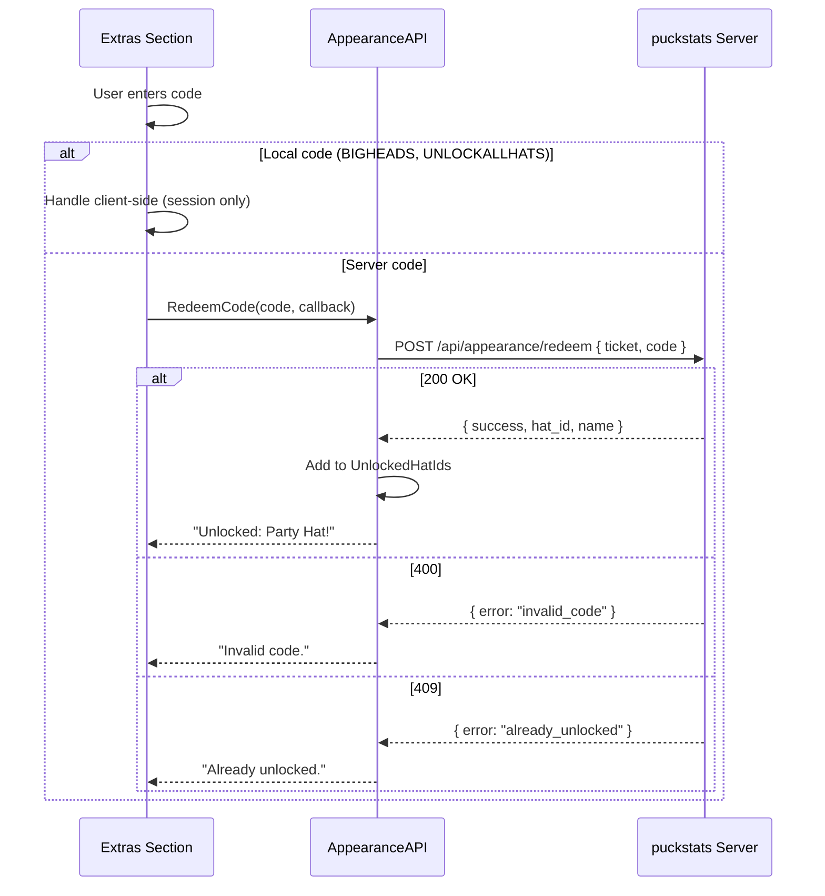

# Appearance System — Client/Server Flow

## Architecture Overview

## Startup Sequence

## Heartbeat / XP Flow

## XP Formula

| Level | XP to next | Cumulative |
|-------|-----------|------------|
| 1→2   | 100       | 100        |
| 2→3   | 150       | 250        |
| 3→4   | 200       | 450        |
| 4→5   | 250       | 700        |
| N→N+1 | 50 + N×50 | —          |

- **In-game:** 0.1 XP/sec (30 XP per 5-min heartbeat)
- **Warmup:** 0.05 XP/sec (15 XP per 5-min heartbeat)
- **Menu:** 0 XP/sec
- **AFK:** 0 XP if < 10 inputs per heartbeat
- **Diminishing returns:** Full XP for first hour, then 75% → 50% → 25% → 10%

## Player Spawn / Appearance Application

## Code Redemption Flow

## Display Settings (Client-Only)

These settings affect how **other players'** appearances render locally:

| Setting | Effect |
|---------|--------|
| Show Personalization | Master toggle — off = all players reset to defaults |
| Show Other Players' Hats | Hide/show hats on other players |
| Show Non-Natural Skin Tones | Replace exotic skin tones with a consistent random natural tone |
